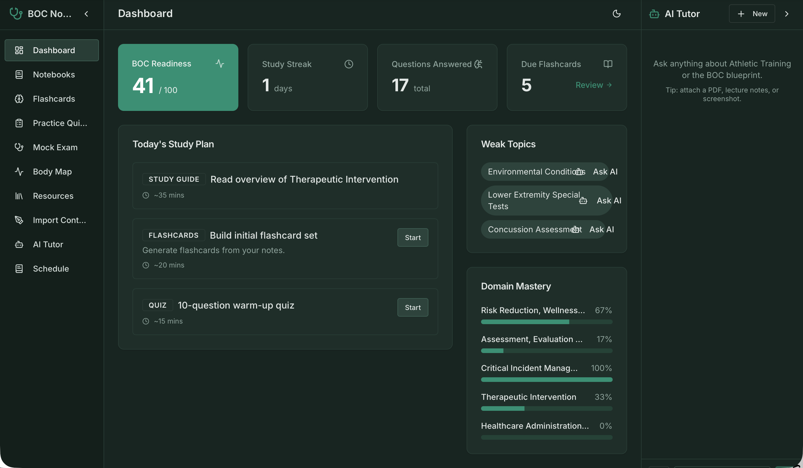
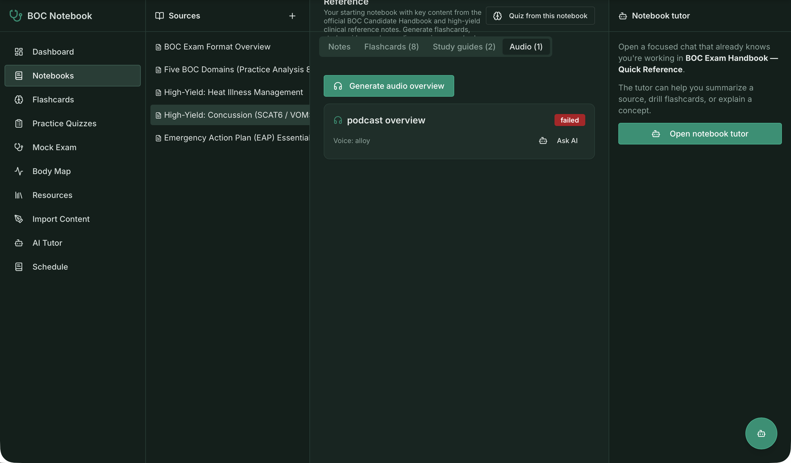
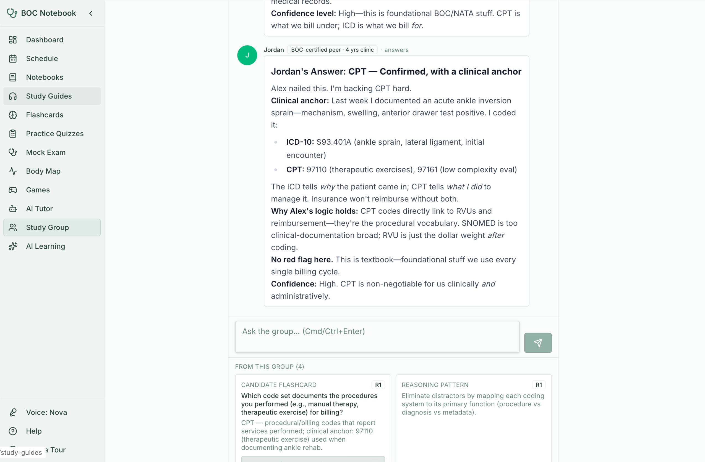

# BOC Study Notebook

A single-user study companion for Athletic Training students preparing for the
Board of Certification (BOC) exam. It combines NotebookLM-style notebooks, an AI
tutor, adaptive and daily practice quizzes, a strict timed mock exam, study
games, and a personalized BOC Pass Plan — all grounded in the BOC *Practice
Analysis, 8th Edition* (PA8) blueprint.

Live app: https://bocforme.replit.app



## Features

- **Notebooks** — NotebookLM-style 3-panel workspace: sources (notes / PDF / URL),
  generated content (notes, flashcards, study guides, audio overviews), and a
  dedicated AI tutor side-panel.
- **AI tutor** — chat grounded in the PA8 blueprint, with per-entity context
  (note, card, guide, resource) and a floating "Ask AI" available on every page.
  Supports file upload with optional save-to-library.
- **Adaptive practice quizzes** — weighted toward weak topics; review screens show
  rationale and sources per question.
- **Daily quiz** — a fresh 50-question AI quiz each day with per-domain review
  sheets, a progress/streak card, score history, and a score-over-time trend chart.
- **Practice retakes** — re-take any past set as a new, independently-scored
  attempt, optionally reshuffling questions and answer choices. Retake scores are
  shown side-by-side with the original, grouped under their source attempt, with a
  per-day "best so far" summary.
- **Mock exam** — strict, full-screen timed exam matching the BOC blueprint
  distribution; server-side timer, no back-navigation, auto-submit, make-up mock,
  and a 75% pass threshold.
- **BOC Pass Plan** — a weakness-first study schedule with a readiness goal band
  and a readiness trend chart (date-range selector, hover tooltips).
- **Blueprint** — expandable per-domain summaries with Importance/Frequency badges
  and a "what to study first" prioritization.
- **Study games** — matching game, body-map practice, and other review modes.
- **Daily reminders** — Web Push notifications with timezone and quiet-day settings.

## Screenshots

**Notebook workspace** — the NotebookLM-style 3-panel layout: sources on the left,
generated content (notes / flashcards / study guides / audio overviews) in the
center, and a source-aware AI tutor on the right.



**Study Group** — collaborative Q&A where BOC-certified peers answer questions with
clinical anchors, and the group's best reasoning is captured as candidate flashcards.



## Stack

- pnpm workspaces, Node.js 24, TypeScript 5.9
- **API**: Express 5, Drizzle ORM, PostgreSQL, Zod (`zod/v4`); bundled with esbuild
- **Web**: React + Vite, wouter, TanStack Query, shadcn/ui, Tailwind, zustand
- **AI**: OpenAI via the Replit AI Integrations proxy — `gpt-5-mini` (chat /
  generation), `gpt-4o-mini-tts` (audio overviews)
- **Codegen**: Orval (axios + react-query hooks + Zod schemas) from a single
  OpenAPI spec

## Project structure

This is a pnpm monorepo. The user-facing product is split across artifacts and
shared libraries:

```
artifacts/
  api-server/      Express API (Drizzle + Postgres), bundled with esbuild
  boc-notebook/    React + Vite web app
  mockup-sandbox/  Component preview sandbox (design only)
lib/
  api-spec/        openapi.yaml — the source of truth for the API contract
  api-client-react/  generated react-query hooks (do not edit by hand)
  api-zod/         generated Zod schemas
  db/              Drizzle schema (lib/db/src/schema/)
  integrations*/   Replit AI Integrations (OpenAI / Anthropic) clients
```

Key locations:

- **API spec (source of truth)**: `lib/api-spec/openapi.yaml` → generates the
  clients under `lib/api-client-react/` and `lib/api-zod/`.
- **DB schema**: `lib/db/src/schema/` (one file per table — notebooks, notes,
  flashcards, study guides, audio overviews, quizzes, questions, mock exams,
  conversations/messages, domains/topics, mastery, readiness snapshots, daily
  quiz sets, reminder prefs, push subscriptions, game sessions, and more).
- **API routes**: `artifacts/api-server/src/routes/`.
- **PA8 grounding metadata**: `artifacts/api-server/src/lib/pa8Reference.ts` and
  `pa8Blueprint.ts`.
- **Web pages**: `artifacts/boc-notebook/src/pages/`.

## Getting started

Required environment variables:

- `DATABASE_URL` — PostgreSQL connection string
- `AI_INTEGRATIONS_OPENAI_BASE_URL`, `AI_INTEGRATIONS_OPENAI_API_KEY` — OpenAI
  access via the Replit AI Integrations proxy

Install dependencies and set up the database:

```bash
pnpm install
pnpm --filter @workspace/db run push          # push schema (dev only)
pnpm tsx artifacts/api-server/src/seed.ts      # seed domains, topics, schedule, starter content
```

Run the apps (each in its own workflow / terminal):

```bash
pnpm --filter @workspace/api-server run dev    # API server
pnpm --filter @workspace/boc-notebook run dev  # web app (Vite)
```

## Development

Common tasks:

```bash
pnpm run typecheck                              # full typecheck
pnpm --filter @workspace/api-spec run codegen   # regenerate hooks/Zod from openapi.yaml
pnpm --filter @workspace/api-server test        # run API server tests
pnpm --filter @workspace/db run push            # push schema changes (dev only)
```

Notes:

- **The API spec is the source of truth.** After editing
  `lib/api-spec/openapi.yaml`, run codegen and restart the API and web workflows.
- **The API server is bundled with esbuild.** Restart its workflow after route or
  schema changes — never edit `dist/` directly.
- **`pdf-parse` is externalized** in `artifacts/api-server/build.mjs` (v2 is
  ESM-only with restricted exports and cannot be bundled).
- The body limit on the API is 5 MB; the multer upload cap is 15 MB.

## Content sourcing policy

The app is grounded in the publicly available BOC PA8 blueprint and user-provided
material. It does **not** scrape or circumvent paywalled BOC prep material (e.g.,
Mometrix, BOC Study Guide). The public Q&A scraper uses an allow-list and blocks
BOC.org and known paywalled vendors. To use material you own, upload PDFs through
the tutor chat upload flow instead.
